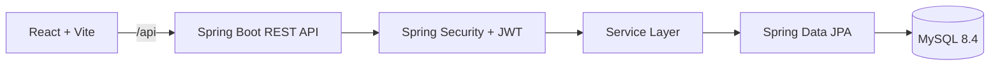

# Secure Library Management System

A full-stack library management system with secure member and administrator workflows. Members can discover books, submit borrowing requests, track due dates, and return items. Administrators can manage inventory, review requests, monitor users, and oversee library activity.

> This repository is the completed release assembled through three public milestones: foundation, core workflows, and final release polish.

## Features

- JWT authentication with BCrypt password hashing
- Role-based access control for members and administrators
- Book catalog search, filtering, availability, and inventory management
- Borrow requests with admin approval and rejection
- Returns, due dates, overdue tracking, and borrow history
- Member and administrator dashboards with live summary data
- In-app notifications and persisted light/dark workspace theme
- Docker Compose deployment with MySQL health checks and persistent storage

## Demo accounts

The development profile seeds these accounts on first startup:

| Role | Username | Password |
| --- | --- | --- |
| Administrator | `admin` | `Admin@123` |
| Member | `user` | `User@123` |

Change or remove these credentials before deploying outside a local demo environment.

## Architecture



## Technology stack

| Layer | Technologies |
| --- | --- |
| Frontend | React 19, Vite, Tailwind CSS, React Router, Axios |
| Backend | Java 25, Spring Boot 3.5, Spring Security, Spring Data JPA |
| Database | MySQL 8.4 |
| Delivery | Docker Compose, Nginx, Maven Wrapper |

## Quick start with Docker

### Prerequisites

- Docker Desktop
- Git

Create a local environment file and start the stack:

```powershell
Copy-Item .env.example .env
# Replace both placeholder values in .env with strong local secrets.
docker compose up --build
```

Open the application at `http://localhost:5173`.

| Service | Address |
| --- | --- |
| Frontend | http://localhost:5173 |
| Backend API | http://localhost:8081 |
| Health check | http://localhost:8081/actuator/health |
| MySQL | localhost:3307 |

Stop the services while preserving database data:

```powershell
docker compose down
```

Use `docker compose down -v` only when you intentionally want to remove the database volume.

## Run locally

### Backend

Use Java 25 and a running MySQL database named `secure_library`. Configure the password expected by your local MySQL installation:

```powershell
$env:SPRING_DATASOURCE_PASSWORD = "your-mysql-password"
.\mvnw.cmd spring-boot:run
```

### Frontend

```powershell
Set-Location frontend
npm ci
npm run dev
```

The frontend defaults to `http://localhost:8080/api` for local API requests. Set `VITE_API_BASE_URL` when the backend uses another address.

## Main API areas

All application endpoints are under `/api` and require a JWT unless noted otherwise:

- `/api/auth/login` and `/api/auth/register` — public authentication
- `/api/users/me` — current user profile
- `/api/books` — catalog search and administrator inventory management
- `/api/borrows` — member requests, returns, and administrator approvals
- `/api/dashboard` — member and administrator summary data

## Quality checks

```powershell
# Backend tests
.\mvnw.cmd test

# Frontend lint and production build
Set-Location frontend
npm run lint
npm run build
```

## Project structure

```text
src/main/java/       Spring Boot API, security, services, and persistence
src/test/             Backend tests
frontend/src/         React application, pages, components, and API clients
docker-compose.yml    Frontend, backend, and MySQL services
Dockerfile            Backend production image
.env.example          Required local environment variables
docs/                 Engineering notes and development log
```

## Security notes

- Never commit `.env`, passwords, JWT secrets, or database dumps.
- Replace the development JWT secret and seeded passwords before any external deployment.
- Development seed accounts are for local demos only.
- Report vulnerabilities privately rather than posting credentials or exploit details in public issues.

## Build milestones

- `day1-foundation`: initial repository and application foundation
- `day2-core-features`: member, admin, catalog, and borrowing workflows
- `day3-final-release`: final documentation, security configuration, and release polish

## License

No license has been selected yet. Add one before accepting external reuse.
