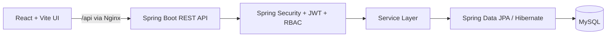

# Secure Library Management System

A full-stack library management application with role-based workflows for members and administrators. It combines a React interface with a secure Spring Boot REST API, MySQL persistence, JWT authentication, and reproducible Docker deployment.

## Highlights

- JWT authentication with protected routes and role-based access control
- Separate member and administrator workflows
- Book search, filtering, availability tracking, borrowing, approval, rejection, and returns
- Live dashboard data, borrow history, overdue status, and in-app notifications
- Persisted light/dark workspace theme
- Spring Data JPA, Hibernate schema management, and seed data for local development
- Containerized frontend, backend, and MySQL services with health checks and persistent storage

## Architecture



## Technology stack

| Layer | Technologies |
| --- | --- |
| Frontend | React 19, Vite, Tailwind CSS, React Router, Axios |
| Backend | Java 25, Spring Boot 3.5, Spring Security, Spring Data JPA, Hibernate |
| Database | MySQL 8.4 |
| Delivery | Docker Compose, Nginx, Maven Wrapper |

## Run with Docker

### Prerequisites

- Docker Desktop

Create the local-only environment file and start the stack:

```powershell
Copy-Item .env.example .env
# Replace the two placeholder values in .env with strong secrets.
docker compose up --build
```

| Service | URL / connection |
| --- | --- |
| Frontend | http://localhost:5173 |
| Backend API | http://localhost:8081 |
| Health endpoint | http://localhost:8081/actuator/health |
| MySQL Workbench | `localhost:3307` |

The host ports 8081 and 3307 avoid common local conflicts. Within Docker, the backend remains on port 8080 and MySQL remains on port 3306.

Stop containers while preserving database records:

```powershell
docker compose down
```

Only `docker compose down -v` removes the named `mysql-data` volume.

## Run locally

### Backend

Use a Java 25 JDK and a running MySQL instance named `secure_library`:

```powershell
$env:DB_PASSWORD = "your-mysql-password"
.\mvnw.cmd spring-boot:run
```

### Frontend

```powershell
Set-Location frontend
npm install
npm run dev
```

The local frontend defaults to `http://localhost:8080/api`. Set `VITE_API_BASE_URL` if your backend uses another port.

## Quality checks

```powershell
# Backend tests (requires Java 25)
$env:JAVA_HOME = "C:\\path\\to\\jdk-25"
.\mvnw.cmd test

# Frontend production build
Set-Location frontend
npm run build
```

## Security notes

- Runtime credentials belong only in `.env`; it is ignored by Git.
- `.env.example` contains placeholders only.
- JWT, BCrypt password hashing, input validation, and role-based endpoint protection are enforced by the backend.
- Development seed accounts are intended for local demos only. Change or remove them before any external deployment.

## Project structure

```text
src/                 Spring Boot application
frontend/            React client and Nginx production configuration
docker-compose.yml   Full local stack
Dockerfile           Backend production image
.env.example         Required environment variable template
docs/                Engineering notes and development log
```

## Development log

See [the Day 1 baseline](docs/DEVELOPMENT_LOG.md) for the public engineering journey and upcoming production-readiness work.

## License

No license has been selected yet. Choose one before publishing if you want others to reuse the code.
