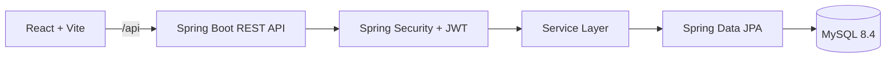

# Secure Library Management System

A full-stack library management system with secure member and administrator workflows. Members can discover books, submit borrowing requests, track due dates, and return items. Administrators can manage inventory, review requests, monitor users, and oversee library activity.

> This repository is the completed release assembled through three public milestones: foundation, core workflows, and final release polish.

## Features

- JWT authentication with BCrypt password hashing
- Role-based access control for members and administrators
- Book catalog search, filtering, availability, and inventory management
- Borrow requests with admin approval and rejection
- Returns, due dates, overdue tracking, and borrow history
- Member and administrator dashboards with live summary data
- In-app notifications and persisted light/dark workspace theme
- Docker Compose deployment with MySQL health checks and persistent storage

## Demo accounts

The development profile seeds these accounts on first startup:

| Role | Username | Password |
| --- | --- | --- |
| Administrator | `admin` | `Admin@123` |
| Member | `user` | `User@123` |

Change or remove these credentials before deploying outside a local demo environment.

## Architecture



## Technology stack

| Layer | Technologies |
| --- | --- |
| Frontend | React 19, Vite, Tailwind CSS, React Router, Axios |
| Backend | Java 25, Spring Boot 3.5, Spring Security, Spring Data JPA |
| Database | MySQL 8.4 |
| Delivery | Docker Compose, Nginx, Maven Wrapper |

## Quick start with Docker

### Prerequisites

- Docker Desktop
- Git
- At least 4 GB of memory available to Docker

Create a local environment file and start the stack:

```powershell
Copy-Item .env.example .env
# Replace both placeholder values in .env with strong local secrets.
docker compose up --build
```

The first startup downloads the images, creates the `secure_library` database, and seeds demo users and books. Keep this terminal open to view service logs. Add `-d` to run in the background:

```powershell
docker compose up --build -d
docker compose logs -f
```

Wait until MySQL is healthy and the backend is running, then open the application at `http://localhost:5173`.

| Service | Address |
| --- | --- |
| Frontend | http://localhost:5173 |
| Backend API | http://localhost:8081 |
| Health check | http://localhost:8081/actuator/health |
| MySQL | localhost:3307 |

Stop the services while preserving database data:

```powershell
docker compose down
```

Use `docker compose down -v` only when you intentionally want to remove the database volume.

## Run locally

### Backend

Use Java 25 and MySQL 8.4 (or a compatible MySQL 8 release). Create a database named `secure_library`, then configure the password expected by your local MySQL installation:

```powershell
$env:SPRING_DATASOURCE_URL = "jdbc:mysql://localhost:3306/secure_library?createDatabaseIfNotExist=true&useSSL=false&useUnicode=true&characterEncoding=UTF-8"
$env:SPRING_DATASOURCE_USERNAME = "root"
$env:SPRING_DATASOURCE_PASSWORD = "your-mysql-password"
$env:JWT_SECRET = "replace-with-a-strong-base64-secret"
.\mvnw.cmd spring-boot:run
```

The backend listens on `http://localhost:8080`. The database schema is updated automatically and development seed data is created on first startup.

### Frontend

```powershell
Set-Location frontend
npm ci
npm run dev
```

The frontend runs on `http://localhost:5173` and defaults to `http://localhost:8080/api` for API requests. If the backend uses another address, create `frontend/.env.local`:

```env
VITE_API_BASE_URL=http://localhost:8080/api
```

### Local startup order

Run the backend first, then start the frontend in a second terminal. Visit `/login`, sign in with a demo account, and use the sidebar to explore the member or administrator workflow.

## Typical user workflow

1. Sign in as `user` and open **Books**.
2. Search or filter the catalog and submit a borrow request.
3. Sign out and sign in as `admin`.
4. Open **Admin** and approve or reject the pending request.
5. Return to the member account to view the updated status, due date, and history.

## Main API areas

All application endpoints are under `/api` and require a JWT unless noted otherwise:

- `/api/auth/login` and `/api/auth/register` — public authentication
- `/api/users/me` — current user profile
- `/api/books` — catalog search and administrator inventory management
- `/api/borrows` — member requests, returns, and administrator approvals
- `/api/dashboard` — member and administrator summary data

The health endpoint is public and can be used to confirm that the backend is available:

```powershell
Invoke-WebRequest http://localhost:8081/actuator/health
```

## Quality checks

```powershell
# Backend tests
.\mvnw.cmd test

# Frontend lint and production build
Set-Location frontend
npm run lint
npm run build
```

## Troubleshooting

### Port already in use

Stop the process using ports `5173`, `8080`, `8081`, `3306`, or `3307`, or change the host mappings in `docker-compose.yml`.

### Database connection fails

Confirm MySQL is running, the database name is `secure_library`, and the configured username and password are correct. With Docker, check the service logs:

```powershell
docker compose logs mysql backend
```

### Login does not work after changing seed credentials

Seed accounts are created only when their usernames do not already exist. Remove the Docker volume with `docker compose down -v` only if you intentionally want a clean local database, then start the stack again.

### Reset the local Docker environment

This removes containers and all stored database records:

```powershell
docker compose down -v
docker compose up --build
```

## Project structure

```text
src/main/java/       Spring Boot API, security, services, and persistence
src/test/             Backend tests
frontend/src/         React application, pages, components, and API clients
docker-compose.yml    Frontend, backend, and MySQL services
Dockerfile            Backend production image
.env.example          Required local environment variables
docs/                 Engineering notes and development log
```

## Security notes

- Never commit `.env`, passwords, JWT secrets, or database dumps.
- Replace the development JWT secret and seeded passwords before any external deployment.
- Development seed accounts are for local demos only.
- Report vulnerabilities privately rather than posting credentials or exploit details in public issues.

## Build milestones

- `day1-foundation`: initial repository and application foundation
- `day2-core-features`: member, admin, catalog, and borrowing workflows
- `day3-final-release`: final documentation, security configuration, and release polish

## License

No license has been selected yet. Add one before accepting external reuse.
